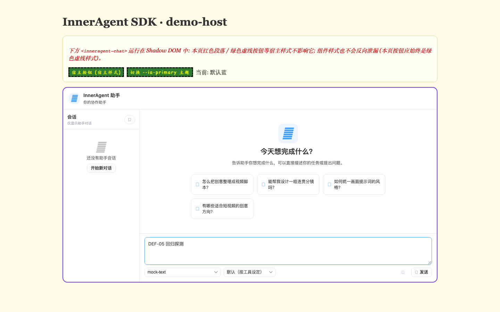
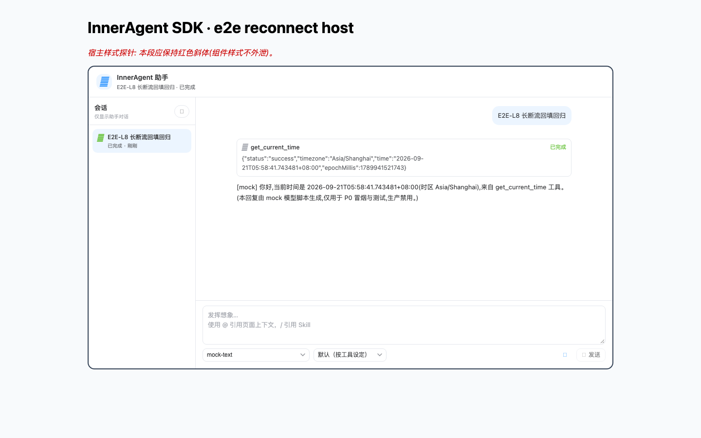

# InnerAgent · 统一测试报告(R1 发现 → 修复 → R2 复测 收官)

- 项目:InnerAgent(内核移植 + 工具中枢 + 管理站 + SDK/接入层)
- 轮次:R1 十线 63 用例(2026-09-21-01)→ 修复批次(服务端 4 提交 + 前端 4 提交 + e2e 期望反转)→ **R2 复测 12 spec 64 用例全绿(2026-09-21-02)**
- 最终判定:**十线全部通过;7 缺陷全部闭环;0 REGRESSED;0 新缺陷。循环可结束。**
- 证据目录:`2026-09-21-01/assets`(R1,~193 份)、`2026-09-21-02/assets`(R2,206 份)

---

## 1. 产品业务线拆解总表(R2 终态)

| # | 业务线 | 覆盖面 | 用例 | R1 | 修复 | R2 | 关键证据(R2 assets/,图片相对路径) |
| --- | --- | --- | --- | --- | --- | --- | --- |
| 1 | 管理站-认证 | 登录/锁定/登出/鉴权矩阵/**UI 登录页** | 9 | 9✅(DEF-01 取证) | 667264d | **9✅** | .png) |
| 2 | 管理站-应用管理 | 应用注册/PEM 校验/轮换/掩码 | 5 | 5✅ | — | **5✅** | `L2-02-注册应用-响应.json` |
| 3 | 工具注册与分诊 | 注册/指纹/分诊三态/停用启用/schema 历史/**复活** | **11**(+1) | 10✅(DEF-02 取证) | c27730f / 338b354 | **11✅** | `L3-05b-DEF02-结论.txt`、`L3-13-DEF03-审计tool_revived.json` |
| 4 | 管理站-授权管理 | 授予/撤销/校验矩阵/级联失效 | 5 | 5✅ | — | **5✅** | `L4-03-校验矩阵.json` |
| 5 | 管理站-审计检索 | 分页/过滤/脱敏/**重授三态** | 7 | 7✅(DEF-04 取证) | fea46de | **7✅** | `L5-07-DEF04-撤销后重授200.json` |
| 6 | 管理站-模型配置 | 模型 CRUD/掩码/连通性探针 | 6 | 6✅ | — | **6✅** | `L6-02-创建配置-响应.json` |
| 7 | SDK 对话链路 | WC 隔离/主题令牌/SSE 流式/会话/**默认接入** | 7 | 7✅(DEF-05 取证) | 00cf15a | **7✅** |  |
| 8 | 断流重连 | 物理断链/Last-Event-ID 续传/**终态回填** | 2 | 2✅(DEF-06 取证) | c4f9a50 | **2✅** |  |
| 9 | 附件上传 | 多模态 chip/读回/越权/超限/类型拒绝 | 3 | 3✅ | — | **3✅**(默认接入) | `L9-05-resourceUrl读回-headers.txt` |
| 10 | 工具确认 UI | 确认卡批准/拒绝/只读直通/SCOPE_RESOLVED/**注册工具可达** | 4 | 4✅(补偿态) | d0e569a + f6c84dd | **4✅**(零补偿) | .png) |
| 附 | mock 域缺口记录 | 熔断/Webhook 页(服务端无端点) | 2 | 2✅ | — | **2✅**(维持 404 记录) | `assets/L7-01-熔断页-真服务模式表现.png`、`assets/L7-02-Webhook页-真服务模式表现.png` |
| 附 | 管理 API 鉴权 UI 矩阵 | 路由守卫/凭据分层/匿名演示链路 | 3 | 3✅ | — | **3✅** | `L11-02-鉴权分层.json` |
| | **合计** | | **64** | 63✅ | 8 提交 | **64✅ ×2 轮** | |

## 2. R1 → 修复 → R2 全程叙事

**R1(第 1 轮)**:十线 63 用例全量首测。管理站六线(01~06)+ 缺口记录线(07)44 用例连跑两轮全绿,但为「取证型通过」—— DEF-01(登录页发占位契约,真服务下管理站 UI 不可用)、DEF-02(UI 刷新空体分诊写空指纹,污染 ADR-5 可复现性)、DEF-03(逻辑删工具重注册 200 假成功)、DEF-04(撤销后重授 500)。SDK 四线(08~11)+ 管理鉴权 UI 线(12)19 用例在两项网关补偿(裸路径重写 + `/runs` 请求体剔除 `enabledMcpTools:[]`)下全绿,同时取证 DEF-05(SDK baseURL 双拼,默认接入全 404)、DEF-06(断流覆盖终态 → UI「已完成」但截断)、DEF-07(空 enabledMcpTools 屏蔽全部注册工具)。另沉淀 FIND-P3×11 + F12~F17 观察项。

**修复批次**:服务端 4 提交(DEF-02 c27730f / DEF-03 338b354 / DEF-04 fea46de 含 V13 部分唯一索引 / DEF-07 服务端 d0e569a 三分法语义)+ 前端 4 提交(DEF-01 667264d / DEF-05 00cf15a / DEF-06 c4f9a50 / DEF-07 SDK 侧 f6c84dd)+ e2e 期望反转 98bff23(L1-08/L7-07/L8-06 取证断言反转为修复后语义)。单测基线同步抬升(surefire 555 / failsafe 78 / web 122 / sdk-js 216+9skip)。

**R2(第 2 轮,本轮)**:产物全部强制重建(jar 重建是硬前提 —— 旧 jar 不含 V11/V13 迁移,新卷初始化时暴露);数据卷因 Flyway 校验失败重建(V1..V13 全量);六工具重新注册;specs 10/11/12 按任务口径切到 demo-host 默认接入;新增 DEF-03 回归用例(交接要求的「注销→重注册」)。**第一遍 64/64(2.2m)**;随后按补偿清理口径删除 SDK_BARE_PREFIX 段与宿主页 `baseURL:''`、重启中转后**第二遍全量 64/64**,且中转日志 0 条改写 —— 七缺陷修复语义在**零补偿**下成立。单测/影子缺陷均未复现(REGRESSED=0),亦未发现新缺陷(DEF-08 起 = 空)。

## 3. 每线最终判定(明细见各线 md)

| 线 | R2 判定 | 说明 |
| --- | --- | --- |
| 01 认证 | ✅ 通过 | DEF-01 关闭:账号密码 200 + Bearer + localStorage + 进入 /apps |
| 02 应用管理 | ✅ 通过 | 无缺陷面;F1~F3 展示位类建议移交 99-优化建议.md |
| 03 工具注册与分诊 | ✅ 通过 | DEF-02/DEF-03 关闭;分诊三态与历史留痕复测无回归 |
| 04 授权管理 | ✅ 通过 | 409 语义(活跃行)复测无回归 |
| 05 审计检索 | ✅ 通过 | DEF-04 关闭(200/200/409 三态) |
| 06 模型配置 | ✅ 通过 | 探针兜底语义复测无回归 |
| 07 SDK 对话链路 | ✅ 通过 | DEF-05 关闭:默认接入 0 双拼 0 404 |
| 08 断流重连 | ✅ 通过 | DEF-06 关闭:uiMissingFooter=false |
| 09 附件上传 | ✅ 通过 | 默认接入复测;F14~F16 维持为建议 |
| 10 工具确认 UI | ✅ 通过 | DEF-07 关闭(零补偿);SCOPE_RESOLVED 照常 |

## 4. 缺陷闭环总表(7/7)

| 缺陷 | 定级 | 一句话根因(R1) | 修复提交 | R2 复测证据 | 判定 |
| --- | --- | --- | --- | --- | --- |
| DEF-01 登录未接线 | P1 | web 发 `{adminKey}` 占位契约,服务端要求 username/password → 400 | `667264d` | `L1-08-DEF01回归-UI登录-网络响应.json`(200/Bearer/14400s)、登录页截图 | **关闭** |
| DEF-02 空体分诊写空指纹 | P1 | UI 刷新空体调分诊,空串指纹入库、历史与授权基准失真 | `c27730f` | `L3-05b-DEF02-结论.txt`(unchanged/schema_not_resent,指纹不覆写) | **关闭** |
| DEF-03 逻辑删复活失效 | P2 | 复活分支 updateById 被 @TableLogic 附加谓词 → 0 行更新假 200 | `338b354` | `L3-13-DEF03-重注册后活跃行.txt`(同 id 复活)+ `L3-13-DEF03-审计tool_revived.json`(**R2 新增回归用例**) | **关闭** |
| DEF-04 撤销重授 500 | P1 | 授权唯一索引不含 deleted 谓词,死行占键 → 裸 DataIntegrityViolation 500 | `fea46de`(V13 + 409 映射) | `L5-07-DEF04-撤销后重授200.json`(200)+ 重复授予 409 | **关闭** |
| DEF-05 baseURL 双拼 | P1 | http 调用点自带前缀 + request() 再拼 → `/ia/api/v1/ia/api/v1/*` 全 404 | `00cf15a` | `L7-07-DEF05回归-默认接入请求清单.json`(0 双拼/0 404,models 200) | **关闭** |
| DEF-06 断流截断投影 | P2 | 轮询先判完成即放弃重连,UI 保留截断 live 投影 | `c4f9a50` | `L8-08-DEF06回归-取证.json`(**uiMissingFooter=false**,UI=库层全文) | **关闭** |
| DEF-07 空 enabledMcpTools | P1 | SDK 空引用下发 `[]` 被当显式空白名单 → 注册工具全不可达 | `d0e569a`(服务端三分法)+ `f6c84dd`(SDK 不下发) | L10 四用例零补偿通过;journal 0 处该字段;server 日志「不在 toolkit」WARN=0 | **关闭** |

REGRESSED 检查:7 项修复在 R2 全部未复现原始缺陷,修复引入的伴随行为(409 语义/unchanged 理由码/回填终态路径)均被既有断言覆盖且通过。

## 5. 测试资产与可复跑性

- 基建:`e2e/`(env.sh 错峰起停、gateway.mjs 真服务网关、reconnect-host.mjs 可断中转+断流开关、helpers 双支撑、12 spec)。
- 复跑性:R2 两轮连跑均 64/64;每用例固定标识符 + 查库自建前置 + finally 物理清理;worker 失败重启不污染(R1 教训制度化)。
- 已知环境差异(非缺陷,详见复测分册 §4):spec 08 L7-02~06 断言基于 `agentType:'demo'`,demo-host 示例未声明 agentType(默认 ai_media),故该五例与断流线共用中转页(demo 口径);其余 59 例均已在 demo-host 默认接入或管理站直连下执行。

## 6. 已知缺口(不阻塞循环,移交 99-优化建议.md)

1. **mock 域缺口(服务端无端点,R1 已按任务口径不定级)**:熔断与紧急停用 `/circuit`、Webhook 观测面 `/webhooks` 真服务模式 404(证据 `2026-09-21-01/assets/L7-01-熔断页-真服务模式表现.png`、`L7-02-Webhook页-真服务模式表现.png`)。R2 复测维持 404(07-mockdomains 2 用例)。终态 Webhook 为 PRD P1(§6.1.2),服务端未排期;页面先行出页且常驻「mock 后端」徽标误导(F8)。
2. **FIND-P3 ×11(R1 管理站分册 §4)+ F12~F17(R1 SDK 分册 §3 观察)**:指纹/轮换展示位、zh-cn locale、时间筛选交互、mock 徽标、scope chip 单工具缺位、消息区附件渲染、超限文案、url 回退静默等 —— 全部维持未修(修复批次仅针对 DEF-01~07),已在 `99-优化建议.md` 按四维给出 26 条可执行优化。
3. **环境差异待清理**:demo-host 示例 agentType 声明(见 §5);完成后 12 spec 可全部脱离中转页(断流线除外)。

## 7. 结论

R1 发现 → 修复 → R2 复测的闭环完整成立:**十线 64 用例两轮全绿、7 缺陷全部关闭、零补偿口径收严通过、环境清理取证完毕。/loop E2E 测试修复循环可以结束。**后续工作为产品化优化(99-优化建议.md,四维 P1/P2/P3 共 26 条)与一项一行级环境对齐(demo-host agentType)。
