# InnerAgent DEMO 业务线全量回归测试报告

| 项 | 值 |
|---|---|
| 报告日期 | 2026-09-23 |
| 报告编号 | TR-20260923-01 |
| 测试对象 | acme-demo 接入演示前端(9203)+ InnerAgent 主服务(18090)+ 管理台网关(18081)+ 演示后端(9300)+ 三方 MCP echo(9401) |
| 测试方式 | Playwright(Chromium 1440×900)黑盒 GUI 回归;真模型对话(MiniMax-M3)以「回复文本稳定轮询」判定收敛 |
| 口径 | **只测不改**;PASS 留关键截图,FAIL 留完整证据链(失败截图 + DOM 文本 dump + 控制台/网络错误) |
| 结果 | **24 用例:21 PASS / 3 FAIL(通过率 87.5%)**;3 个失败归因为 **2 个独立缺陷**(1 个前端插槽错配、1 个服务端工具面装配缺陷) |

---

## 1. 结论摘要(TL;DR)

1. **21/24 通过**。登录会话、接入总览(除状态徽标)、场景画廊、WC 直挂对话(SSE 真模型)、KB 引用、Skill 注入、子 Agent 编排、工具演示页、管理台嵌入、体验台、iframe postMessage 握手等主干能力全部可用,MiniMax-M3 真模型回复延迟约 6-9 秒。
2. **DEF-01(前端,P2)**:总览页「开通状态」徽标永不渲染——`FcSectionHeader` 的插槽名是 `actions`,Overview.vue 误用 `#extra`,插槽静默丢弃(一行修复,见 §4)。
3. **DEF-02(服务端,P1,阻断核心演示线)**:**宿主桥工具未进入内核工具面**——ticket-assistant 对话中模型自述「本环境没有可调用的 create_ticket 工具」,确认卡永不出现,建单确认流端到端失效。运行快照证据:`tools:[]`、`agentMcpConfigFingerprint=e3b0c442…(空串哈希)`;全库无任何 create_ticket 工具调用事件。L5-1/L5-3 两个失败同根于此。
4. 环境健康:五服务全部在线;`server-status` API 返回 `registered` + 指纹一致,证明 DEF-01 纯属前端呈现层问题。

---

## 2. 测试环境

- 分支 main;提交基线 `6fddbcf`(测试为只读,不含任何代码改动)。
- 服务探活:18090 JWKS 200 / 18081 200 / 9203 200 / 9300 config 200 / 9401 进程在线(MCP 端点 404 为正常根路径行为)。
- 演示登录:alice(轻登录);管理台:admin / Admin#12345(独立会话)。
- 用例执行记录:`results.json`(含每用例耗时、截图清单、控制台/网络错误);驱动脚本存档:`attachments/demo-regression.driver.mjs`。

## 3. 结果总表

| 业务线 | 用例 | 结果 | 关键证据 |
|---|---|---|---|
| L0 站点框架 | 首页渲染 | ✅ | 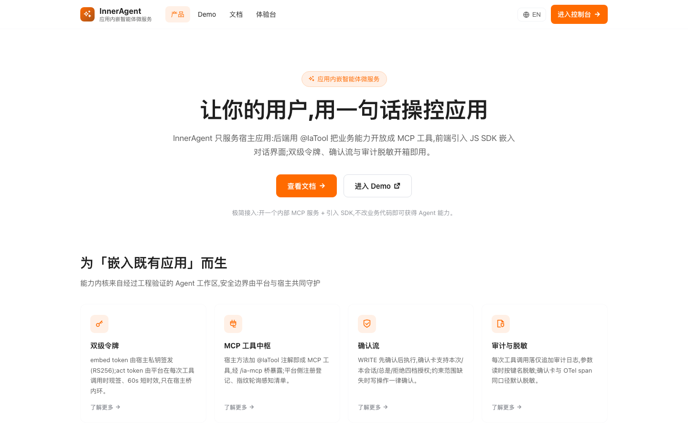 |
| L1 登录与会话 | 空用户名拦截 / 轻登录 / 登出 | ✅✅✅ | 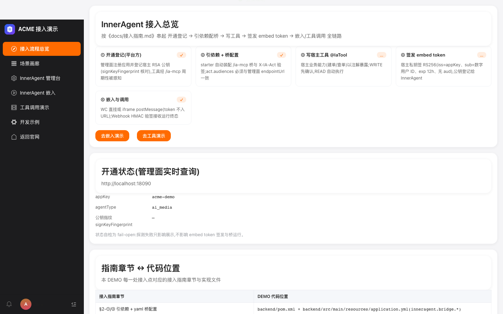 |
| L2 接入总览 | 五步自检 | ✅ |  |
| L2 接入总览 | **开通状态徽标** | ❌ **DEF-01** |  |
| L2 接入总览 | 能力覆盖表(19 行全落点) | ✅ |  |
| L3 场景画廊 | 五卡+矩阵 / 剧本折叠 / 深链 | ✅✅✅ | 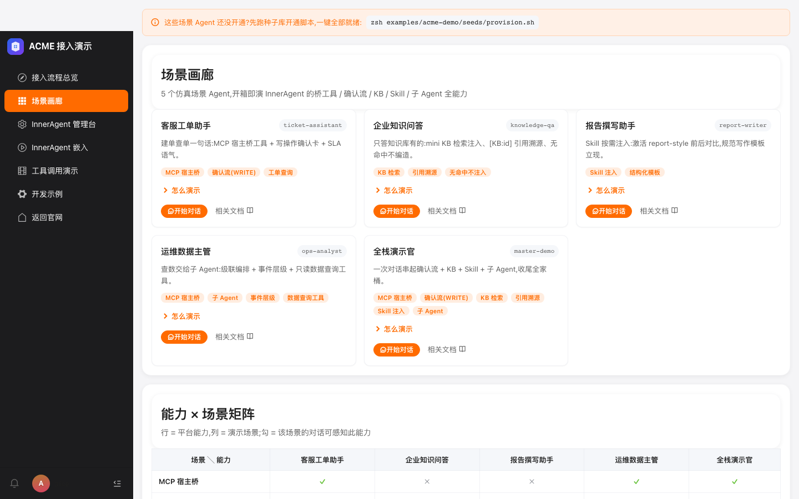 |
| L4 嵌入对话·WC | 挂载 / SSE 真模型 / Enter 行为 / 重挂载 | ✅✅✅✅ | 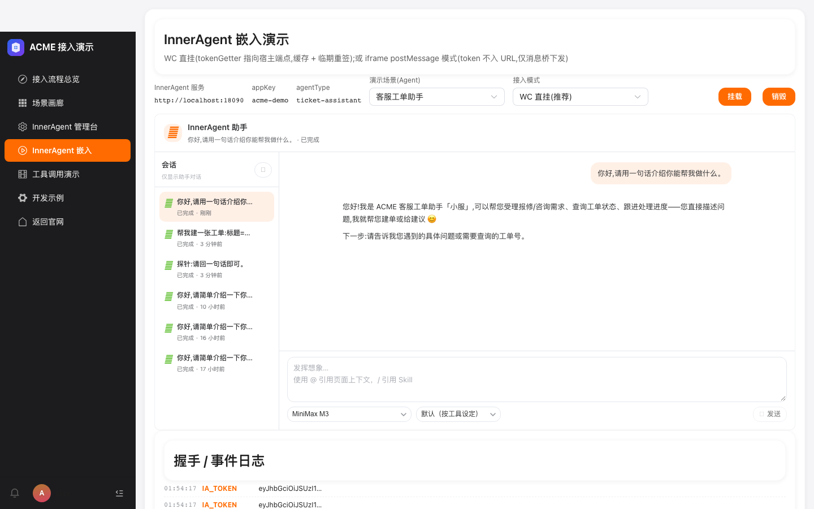 |
| L5 确认流(WRITE) | **确认卡出现** | ❌ **DEF-02** | 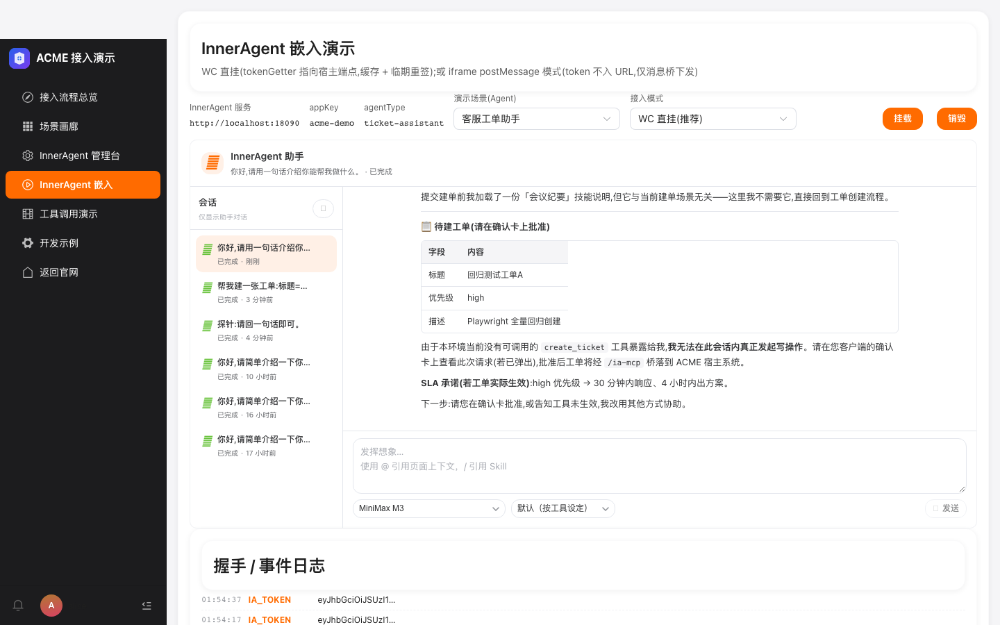 |
| L5 确认流(WRITE) | **台账 channel=agent** | ❌ 同上 | 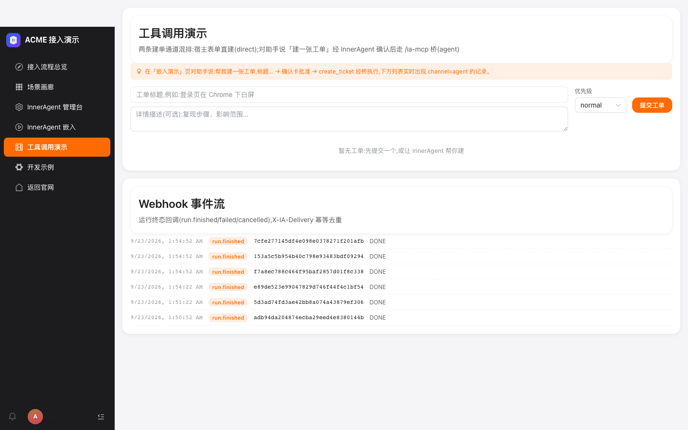 |
| L6 KB 检索 | [KB:] 引用标记 | ✅ | 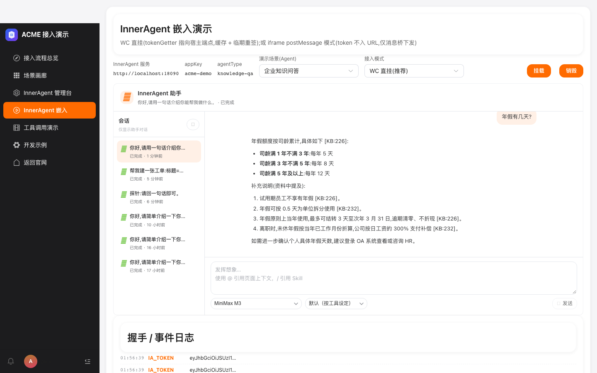 |
| L7 Skill 注入 | report-writer 回复 | ✅ | 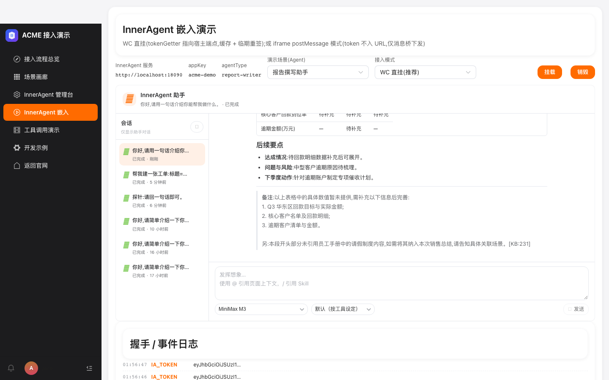 |
| L8 子 Agent | ops-analyst 双层编排 | ✅ | 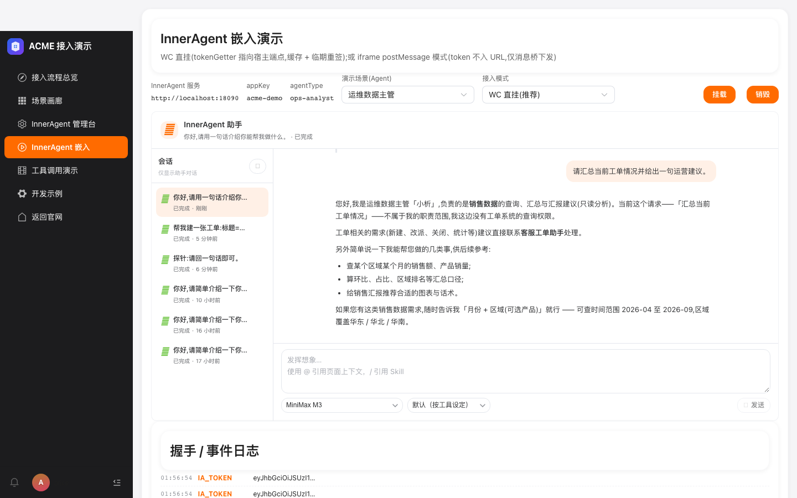 |
| L9 工具演示 | 直建工单 / 事件流 | ✅✅ | 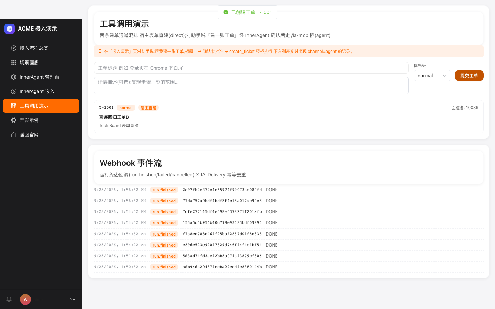 |
| L10 管理台嵌入 | iframe 独立登录+定义页 | ✅ | 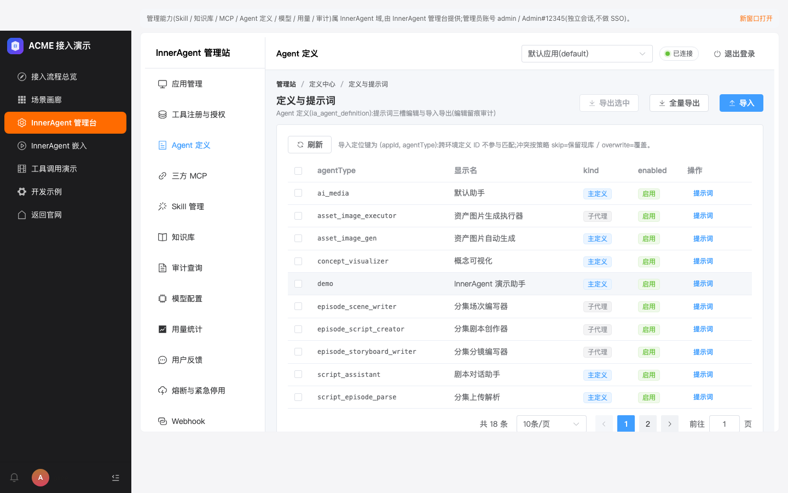 |
| L11 体验台 | token 签发+claims 可视化 | ✅ | 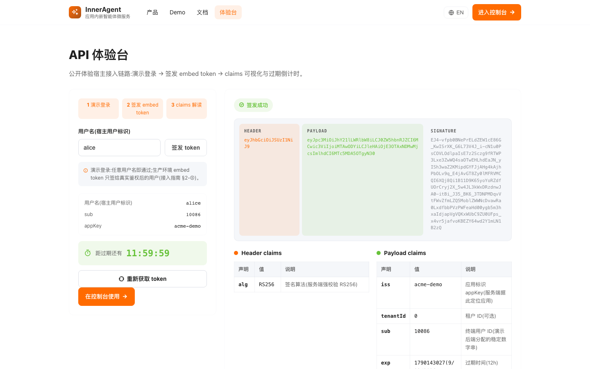 |
| L12 iframe 模式 | postMessage 握手 | ✅ | 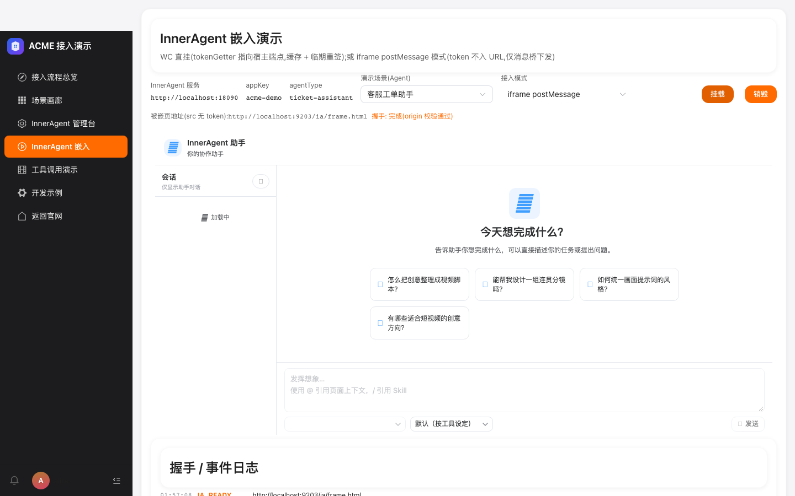 |
| L1 登录与会话 | 登出 | ✅ |  |

## 4. 缺陷清单与修复意见(只给方案,本轮未改任何代码)

### DEF-20260923-01|总览页开通状态徽标永不渲染|P2|前端

- **现象**:「开通状态(管理面实时查询)」区块的 appKey/agentType/指纹字段全部正常,但右上角状态徽标(`data-testid="server-state"`)整体缺失,页面任何位置都没有「应用已注册」等状态文案。
- **证据链**:`assets/L2-2-fail.png`(字段齐全、徽标缺席)+ `assets/L2-2-fail-dom.txt`(全文无状态文案)+ 后端旁证:`GET /api/ia/server-status` 实时返回 `{"state":"registered",...}`,排除服务端原因。
- **根因**:`FcSectionHeader.vue` 的具名插槽是 **`actions`**(`components/sdk/section/FcSectionHeader.vue:30`),而 `views/ia/Overview.vue` 状态区块用的是 **`<template #extra>`**——插槽名错配,内容被静默丢弃。
- **修复意见**:①`Overview.vue` 该处 `#extra` 改为 `#actions`(一行);②给 FcSectionHeader 增加一条「未知插槽名告警」或组件测试断言 `actions` 插槽内容可见,防止再次错配;③顺带在徽标旁补「最近检测时间 + 手动重查」(状态自检是 fail-open,用户需要知道数据新鲜度)。
- **影响面**:接入自检第一步的核心状态不可见(功能降级,不阻断运行)。

### DEF-20260923-02|宿主桥工具未进入内核工具面,建单确认流端到端失效|P1|服务端(阻断核心演示线)

- **现象**:ticket-assistant 对话中,模型正确复述工单要素并尝试发起建单,但随即声明「本环境当前没有可调用的 `create_ticket` 工具暴露给我,我无法在此会话内真正发起写操作」;确认卡永不出现;`/ia/tools` 台账无 agent 渠道记录。
- **证据链**:
  1. 对话证据:`assets/L5-1-fail.png`(120s 无确认卡)+ `assets/L5-1-fail-dom.txt`;
  2. 台账证据:`assets/L5-3-fail.png`(无「回归测试工单A」);
  3. 服务端运行快照(ia_agent_run,run=7cfe2771…):`"tools":[]`、`"agentMcpConfigFingerprint":"e3b0c442…b855"(空串 SHA-256)`;
  4. 事件层(ia_agent_event):该轮仅有内建技能工具 `load_skill_through_path` 调用成功,**全库不存在任何 create_ticket 的 TOOL_CALL 事件**;
  5. 旁证:管理面 `/me/reference-options` 在两种应用上下文下 `mcpTools` 均为空(AgentScopeMcpRegistry 目录为空);
  6. 排除项:工具注册表 4 个 acme-demo 工具在册(fqn/风险级齐全)、定义 `toolWhitelist` 含 create_ticket、run 行 `app_id=34` 正确、/ia-mcp 桥 401(fail-closed 预期)、演示后端在线。
- **根因定位(方向)**:定义快照的 `toolWhitelist → ia_tool_registry → 内核工具 schema` 装配链在「宿主桥 MCP 配置」一环断链——`agentMcpConfigFingerprint` 为空串哈希说明该 agent 的 MCP 配置为空,注册表目录(AgentScopeMcpRegistry)整体为空目录。数据库实例曾重建,无法确认是「回归」还是「该实例从未通过」;但 09-20 M1 旅程/09-21 R 批次曾全绿,倾向「重建库后 agent 级 MCP 配置行丢失且无重建步骤」。
- **修复意见**:
  1. 修复 `AgentScopeMcpRegistry`/内核工具装配:对照 09-20 M1 通过时的装配路径,补齐 acme-demo 桥(`http://localhost:9300/ia-mcp`)作为 agent 级 MCP 来源(定义 spec、种子迁移或 provision 三选一,明确唯一权威来源);
  2. **provision.sh 增加工具面自检**:provisioning 完成后以一次真实运行或 resolve-scope 调用断言 `create_ticket` 可达,缺失即 fail(防再次静默丢面);
  3. 增加内核层守卫 IT:「白名单+注册表非空 ⇒ 运行快照 tools 非空」,与本轮 Skill 作用域守卫 IT 同层;
  4. 交互兜底(前端,可选):模型回复包含「没有可调用的工具/无法发起写操作」字样且场景为确认流时,界面给出「工具面未挂载」诊断提示,避免演示现场翻车。
- **影响面**:确认流(WRITE 先确认)是本 DEMO 的核心卖点(覆盖表 L2 行、系统提示词第一段都在讲它),当前为**演示级阻断**。

## 5. 通过项亮点(有证据的关键图)

- **SSE 真模型流式**:挂载→提问→8 秒内完整回复,身份话术/下一步引导符合系统提示词设计(`assets/L4-2-sse-reply.png`)。
- **Enter 行为**:输入框 Enter=换行不误发、点「发送」才提交,符合接入文档口径(`assets/L4-3-enter-newline.png`、`L4-3-sent-ok.png`)。
- **KB 引用**:回答内嵌 `[KB:226]/[KB:232]` 可溯源标记,条目化呈现年假口径(`assets/L6-1-kb-citation.png`)。
- **覆盖表**(本轮新增的验收工件):19 行能力×入口全部可归类(`assets/L2-3-coverage.png`)。
- **管理台嵌入**:iframe 内独立管理员会话登录,跨源链路稳定(`assets/L10-1-admin-embed.png`)。
- **体验台**:token 签发 + sub/exp/iss claims 可视化齐全(`assets/L11-1-playground.png`)。
- **iframe postMessage 握手**:模式切换后握手完成标记可见(`assets/L12-1-iframe-handshake.png`)。

## 6. 复测指引

1. 驱动:`node e2e/…`(存档见 `attachments/demo-regression.driver.mjs`),前置:五服务在线 + `zsh examples/acme-demo/seeds/provision.sh`。
2. DEF-01 修复后:L2-2 应转 PASS(徽标文案「应用已注册」可见)。
3. DEF-02 修复后:重跑 L5-1/L5-3,确认确认卡出现→批准→台账 channel=agent 记录产生;并建议追加「重复批准幂等」与「拒绝路径不落单」两条用例。

— 测试执行与报告:ZCode 自动化回归(Playwright),2026-09-23。
